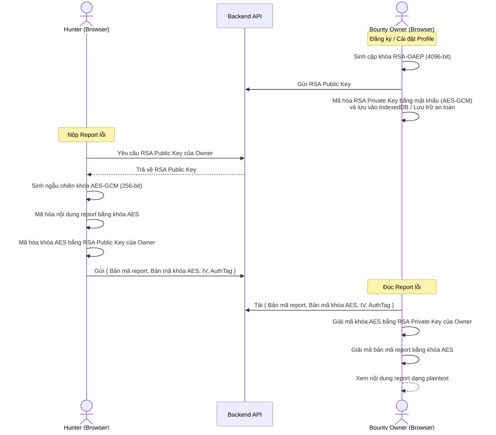

# Đề Xuất Giải Pháp Cải Tiến & Khắc Phục Rủi Ro Hệ Thống BugChain

Tài liệu này trình bày chi tiết thiết kế giải pháp kỹ thuật, mã nguồn minh họa và quy trình triển khai nhằm giải quyết triệt để **5 điểm rủi ro lớn** đã được chỉ ra trong báo cáo đánh giá hệ thống của dự án BugChain.

---

## 1. Giải pháp Mã hóa Báo cáo Đầu cuối (End-to-End Encryption - E2EE)

### 1.1. Kiến trúc E2EE Hybrid (RSA + AES-GCM)
Do ví Freighter (chạy trên Ed25519) không hỗ trợ giải mã dữ liệu trực tiếp bằng khóa bảo mật của ví, chúng ta sử dụng cơ chế mã hóa lai (Hybrid Encryption) bằng cặp khóa RSA-OAEP được quản lý bởi Client.



### 1.2. Hướng dẫn Triển khai ở Frontend (Sử dụng Web Crypto API)
Dưới đây là code JavaScript chạy trên trình duyệt của Hunter và Owner để mã hóa/giải mã:

```javascript
// 1. Sinh cặp khóa RSA-OAEP cho Owner
async function generateOwnerKeyPair() {
  const keyPair = await window.crypto.subtle.generateKey(
    {
      name: "RSA-OAEP",
      modulusLength: 4096,
      publicExponent: new Uint8Array([1, 0, 1]),
      hash: "SHA-256",
    },
    true,
    ["encrypt", "decrypt"]
  );
  return keyPair;
}

// 2. Mã hóa nội dung báo cáo lỗi (Bên Hunter)
async function encryptReportForOwner(reportData, ownerPublicKeySpkiHex) {
  // Import Public Key của Owner
  const publicKeyBuffer = hexToBuffer(ownerPublicKeySpkiHex);
  const ownerPublicKey = await window.crypto.subtle.importKey(
    "spki",
    publicKeyBuffer,
    { name: "RSA-OAEP", hash: "SHA-256" },
    false,
    ["encrypt"]
  );

  // Sinh khóa AES đối xứng ngẫu nhiên
  const aesKey = await window.crypto.subtle.generateKey(
    { name: "AES-GCM", length: 256 },
    true,
    ["encrypt", "decrypt"]
  );

  // Mã hóa nội dung report bằng AES-GCM
  const iv = window.crypto.getRandomValues(new Uint8Array(12));
  const plaintext = new TextEncoder().encode(JSON.stringify(reportData));
  const encryptedReportBuffer = await window.crypto.subtle.encrypt(
    { name: "AES-GCM", iv: iv },
    aesKey,
    plaintext
  );

  // Export khóa AES và mã hóa nó bằng RSA Public Key của Owner
  const exportedAesKey = await window.crypto.subtle.exportKey("raw", aesKey);
  const encryptedAesKeyBuffer = await window.crypto.subtle.encrypt(
    { name: "RSA-OAEP" },
    ownerPublicKey,
    exportedAesKey
  );

  return {
    encryptedContent: bufferToBase64(encryptedReportBuffer),
    encryptedAesKey: bufferToBase64(encryptedAesKeyBuffer),
    iv: bufferToBase64(iv),
  };
}
```

---

## 2. Smart Contract Phê duyệt Nhiều Lần (Multi-Payout Escrow)

### 2.1. Cải tiến Logic Lưu trữ
Thay vì lưu `bounty.status` là `Completed` và đóng bounty ngay sau một lần duyệt report, chúng ta thiết kế Bounty như một quỹ liên tục (Continuous Pool):
- Bounty có một trường `balance: i128` theo dõi số dư thực tế trong Escrow.
- Cho phép Owner nạp thêm tiền qua hàm `deposit_funds`.
- Owner có thể duyệt nhiều báo cáo lỗi khác nhau, mỗi lỗi trả thưởng một phần tiền dựa trên mức độ nghiêm trọng (`reward_amount`).
- Bounty chỉ đóng (`Closed`) khi Owner chủ động rút hết số dư hoặc khi hết hạn và Owner rút toàn bộ phần dư còn lại.

### 2.2. Mã nguồn Rust cập nhật (`contracts/bugchain/src/contract.rs`)

```rust
// Cấu trúc Bounty cải tiến hỗ trợ số dư động
#[contracttype]
#[derive(Clone, Debug, Eq, PartialEq)]
pub struct Bounty {
    pub id: u64,
    pub owner: Address,
    pub asset: Address,
    pub total_escrowed: i128,
    pub remaining_balance: i128, // Theo dõi số dư còn lại trong Escrow
    pub deadline: u64,
    pub metadata_hash: BytesN<32>,
    pub status: BountyStatus, // Open, Closed, Refunded
}

#[contractimpl]
impl BugChainContract {
    // 1. Phê duyệt báo cáo lỗi và chuyển tiền thưởng động (Partial Payout)
    pub fn approve_report_with_payout(
        env: Env, 
        owner: Address, 
        bounty_id: u64, 
        report_id: u64, 
        payout_amount: i128
    ) {
        owner.require_auth();
        storage::require_initialized(&env);

        let mut bounty = storage::get_bounty(&env, bounty_id);
        let mut report = storage::get_report(&env, report_id);

        if owner != bounty.owner {
            panic_with_error!(&env, BugChainError::Unauthorized);
        }
        if bounty.status != BountyStatus::Open {
            panic_with_error!(&env, BugChainError::BountyNotOpen);
        }
        if report.bounty_id != bounty_id {
            panic_with_error!(&env, BugChainError::ReportDoesNotBelongToBounty);
        }
        if report.status != ReportStatus::Pending {
            panic_with_error!(&env, BugChainError::ReportNotPending);
        }
        if payout_amount <= 0 || payout_amount > bounty.remaining_balance {
            panic_with_error!(&env, BugChainError::InvalidPayoutAmount);
        }

        // Cập nhật số dư bounty
        bounty.remaining_balance -= payout_amount;
        if bounty.remaining_balance == 0 {
            bounty.status = BountyStatus::Closed;
        }

        // Cập nhật trạng thái báo cáo lỗi thành Approved
        report.status = ReportStatus::Approved;
        report.payout_amount = payout_amount; // Lưu lại số tiền được duyệt thanh toán

        // Ghi lại thay đổi
        storage::set_bounty(&env, &bounty);
        storage::set_report(&env, &report);

        // Chuyển khoản tiền thưởng trực tiếp cho Hunter
        let contract_address = env.current_contract_address();
        let token_client = token::Client::new(&env, &bounty.asset);
        token_client.transfer(&contract_address, &report.hunter, &payout_amount);

        events::report_approved(&env, bounty_id, report_id, report.hunter, payout_amount);
    }
}
```

---

## 3. Xác thực Giao dịch Đồng bộ trên Backend (Transaction Verification)

### 3.1. Rủi ro
Backend nhận `txHash` của bất kỳ giao dịch nào và tự động đánh dấu thành công mà không gọi kiểm tra trên Blockchain Ledger thông qua RPC.

### 3.2. Giải pháp Triển khai tại NestJS Backend
Chúng ta tạo một Service `StellarValidationService` nhằm gọi trực tiếp tới Soroban RPC để phân tích dữ liệu XDR của giao dịch và xác minh tính hợp lệ.

```typescript
import { Injectable, BadRequestException } from '@nestjs/common';
import { rpc, xdr, Networks, scValToNative } from '@stellar/stellar-sdk';

@Injectable()
export class StellarValidationService {
  private server: rpc.Server;
  private readonly contractId = process.env.VITE_CONTRACT_ID;
  private readonly networkPassphrase = process.env.VITE_STELLAR_NETWORK_PASSPHRASE || 'Test SDF Network ; September 2015';

  constructor() {
    this.server = new rpc.Server(process.env.VITE_STELLAR_RPC_URL || 'https://soroban-testnet.stellar.org');
  }

  async validateBountyCreationTx(txHash: string, expectedAmount: number, expectedMetadataHash: string): Promise<boolean> {
    try {
      const txResult = await this.server.getTransaction(txHash);

      if (txResult.status !== 'SUCCESS') {
        throw new BadRequestException('Transaction was not successful on-chain');
      }

      // Giải mã envelope XDR của transaction
      const txEnvelope = xdr.TransactionEnvelope.fromXDR(txResult.envelopeXdr, 'base64');
      const tx = txEnvelope.value();
      const operations = tx.operations();

      // Kiểm tra xem transaction có chứa lệnh gọi contract BugChain hay không
      const invokeOp = operations.find(op => op.body().switch() === xdr.OperationType.invokeHostFunction());
      if (!invokeOp) {
        throw new BadRequestException('Transaction does not contain a host function invocation');
      }

      const hostFn = invokeOp.body().invokeHostFunctionOp().hostFunction();
      if (hostFn.switch() !== xdr.HostFunctionType.hostFunctionTypeInvokeContract()) {
        return false;
      }

      const invokeContract = hostFn.invokeContract();
      const contractAddress = invokeContract.contractAddress().toString();
      
      // Khớp Contract ID
      if (contractAddress !== this.contractId) {
        throw new BadRequestException('Transaction called an incorrect contract address');
      }

      // Phân tích tham số truyền vào hàm contract
      const functionName = invokeContract.functionName().toString();
      if (functionName !== 'create_bounty') {
        throw new BadRequestException('Incorrect function called in transaction');
      }

      const args = invokeContract.args();
      // args[2] là reward_amount (i128)
      const actualAmountStroops = scValToNative(args[2]) as bigint;
      // args[4] là metadata_hash (bytes)
      const actualMetadataHashBytes = scValToNative(args[4]) as Buffer;
      const actualMetadataHash = actualMetadataHashBytes.toString('hex');

      // Chuyển đổi expectedAmount sang stroops
      const expectedAmountStroops = BigInt(expectedAmount * 10_000_000);

      if (actualAmountStroops !== expectedAmountStroops) {
        throw new BadRequestException('Reward amount mismatch between API payload and on-chain Tx');
      }

      if (actualMetadataHash !== expectedMetadataHash) {
        throw new BadRequestException('Metadata hash mismatch');
      }

      return true;
    } catch (error) {
      throw new BadRequestException(`On-chain transaction verification failed: ${error.message}`);
    }
  }
}
```

---

## 4. Đồng bộ Sự kiện Bền vững (Durable Event Indexing)

### 4.1. Thiết kế Schema Prisma lưu Checkpoint
Thêm bảng `SyncCheckpoint` vào file [schema.prisma](file:///d:/TheAnhProject/BugChain/backend/prisma/schema.prisma) để ghi nhớ vĩnh viễn block sequence cuối cùng đã xử lý thành công:

```prisma
model SyncCheckpoint {
  serviceName         String   @id
  lastProcessedLedger Int
  updatedAt           DateTime @updatedAt
}
```

### 4.2. Mã nguồn Event Sync Service cập nhật (`backend/src/transactions/event-sync.service.ts`)

```typescript
@Injectable()
export class EventSyncService implements OnModuleInit {
  private readonly serviceName = 'STELLAR_EVENT_SYNC';
  private lastLedger = 0;

  async onModuleInit() {
    // 1. Đọc checkpoint từ database
    const checkpoint = await this.prisma.syncCheckpoint.findUnique({
      where: { serviceName: this.serviceName },
    });

    if (checkpoint) {
      this.lastLedger = checkpoint.lastProcessedLedger;
      this.logger.log(`Resuming event sync from stored checkpoint ledger: ${this.lastLedger}`);
    } else {
      // Nếu chưa có checkpoint, fallback về ledger mới nhất trừ đi 10 block làm khoảng đệm an toàn
      const latestLedgerRes = await this.server.getLatestLedger();
      this.lastLedger = Math.max(1, latestLedgerRes.sequence - 10);
      
      await this.prisma.syncCheckpoint.create({
        data: {
          serviceName: this.serviceName,
          lastProcessedLedger: this.lastLedger,
        },
      });
    }

    setInterval(() => this.syncEvents(), 10000);
  }

  async syncEvents() {
    try {
      const latestLedgerRes = await this.server.getLatestLedger();
      const currentLedger = latestLedgerRes.sequence;

      if (this.lastLedger >= currentLedger) return;

      // 2. Truy vấn sự kiện theo từng dải ledger nhỏ để tránh tràn bộ nhớ
      const start = this.lastLedger + 1;
      const end = currentLedger;

      const response = await this.server.getEvents({
        startLedger: start,
        filters: [{ type: 'contract', contractIds: [this.contractId] }],
        limit: 100,
      });

      if (response.events && response.events.length > 0) {
        // Chạy giao dịch Prisma để xử lý sự kiện kèm cập nhật checkpoint nguyên tử (Atomic transaction)
        await this.prisma.$transaction(async (tx) => {
          for (const event of response.events) {
            await this.processEventWithTx(tx, event);
          }

          // Cập nhật checkpoint trong cùng một transaction
          await tx.syncCheckpoint.update({
            where: { serviceName: this.serviceName },
            data: { lastProcessedLedger: end },
          });
        });
      } else {
        // Nếu không có sự kiện mới, chỉ cập nhật checkpoint số ledger
        await this.prisma.syncCheckpoint.update({
          where: { serviceName: this.serviceName },
          data: { lastProcessedLedger: end },
        });
      }

      this.lastLedger = end;
    } catch (err) {
      this.logger.error('Failed to sync events and update checkpoint', err);
    }
  }
}
```

---

## 5. Cơ chế Trọng Tài Phi Tập Trung (Decentralized Dispute Resolution)

Để giải quyết trường hợp Bounty Owner nhận báo cáo lỗi nhưng từ chối thanh toán một cách phi lý, chúng ta đưa vai trò **Arbitrator** vào Smart Contract.

### 5.1. Quy trình Giải quyết Tranh chấp
```
Hunter nộp Report -> Owner từ chối (Reject)
                      │
                      ▼
Hunter yêu cầu Trọng tài (Escalation / Dispute)
                      │
                      ▼
     Trạng thái chuyển thành "Disputed"
                      │
                      ▼
Hội đồng Trọng tài (Arbitrators) phân tích & biểu quyết
                      │
        ┌─────────────┴─────────────┐
        ▼                           ▼
 Arbitrators duyệt          Arbitrators bác bỏ
  (Approve Dispute)         (Reject Dispute)
        │                           │
        ▼                           ▼
Chuyển khoản cho Hunter    Trả lại tiền cho Owner
```

### 5.2. Mã nguồn Rust cho Trọng tài (`contract.rs`)

```rust
#[contracttype]
pub enum ReportStatus {
    Pending,
    Approved,
    Rejected,
    Disputed, // Trạng thái tranh chấp mới
    Paid,
}

#[contractimpl]
impl BugChainContract {
    // 1. Hunter kích hoạt khiếu nại nếu report bị Reject oan
    pub fn escalate_dispute(env: Env, hunter: Address, report_id: u64) {
        hunter.require_auth();
        let mut report = storage::get_report(&env, report_id);
        
        if report.hunter != hunter {
            panic_with_error!(&env, BugChainError::Unauthorized);
        }
        if report.status != ReportStatus::Rejected {
            panic_with_error!(&env, BugChainError::CannotEscalateNonRejectedReport);
        }

        report.status = ReportStatus::Disputed;
        storage::set_report(&env, &report);
        events::dispute_escalated(&env, report.bounty_id, report_id);
    }

    // 2. Hội đồng Trọng tài phán quyết (Chỉ Admin/Arbitrator được cấu hình mới có quyền gọi)
    pub fn resolve_dispute(
        env: Env, 
        arbitrator: Address, 
        bounty_id: u64, 
        report_id: u64, 
        payout_hunter: bool
    ) {
        arbitrator.require_auth();
        
        // Xác minh quyền Arbitrator từ storage (ví dụ: khớp với Admin hoặc multisig pool)
        let admin = storage::get_admin(&env);
        if arbitrator != admin {
            panic_with_error!(&env, BugChainError::Unauthorized);
        }

        let mut bounty = storage::get_bounty(&env, bounty_id);
        let mut report = storage::get_report(&env, report_id);

        if report.status != ReportStatus::Disputed {
            panic_with_error!(&env, BugChainError::ReportNotDisputed);
        }

        let contract_address = env.current_contract_address();
        let token_client = token::Client::new(&env, &bounty.asset);

        if payout_hunter {
            // Chuyển tiền thưởng từ Escrow sang Hunter
            token_client.transfer(&contract_address, &report.hunter, &bounty.reward_amount);
            report.status = ReportStatus::Paid;
            bounty.status = BountyStatus::Completed;
        } else {
            // Trả tiền về cho Owner, đóng report vĩnh viễn
            token_client.transfer(&contract_address, &bounty.owner, &bounty.reward_amount);
            report.status = ReportStatus::Rejected;
            bounty.status = BountyStatus::Closed;
        }

        storage::set_report(&env, &report);
        storage::set_bounty(&env, &bounty);
        events::dispute_resolved(&env, bounty_id, report_id, payout_hunter);
    }
}
```

---

## 6. Kế hoạch Triển khai (Roadmap)

1. **Giai đoạn 1 (Smart Contract):** Refactor code smart contract trong môi trường local, bổ sung testcase cho hàm `resolve_dispute` và `approve_report_with_payout`.
2. **Giai đoạn 2 (Database Schema):** Thêm bảng `SyncCheckpoint` và cập nhật migrate DB để tránh mất dữ liệu ledger.
3. **Giai đoạn 3 (Backend Validation & Sync):** Triển khai `StellarValidationService` nhằm verify hash trước khi update DB, đồng thời tích hợp lưu checkpoint ledger.
4. **Giai đoạn 4 (Client-side Cryptography):** Xây dựng module sinh và quản lý key cặp RSA ở Frontend và tích hợp thư viện mã hóa trước khi nộp report.
