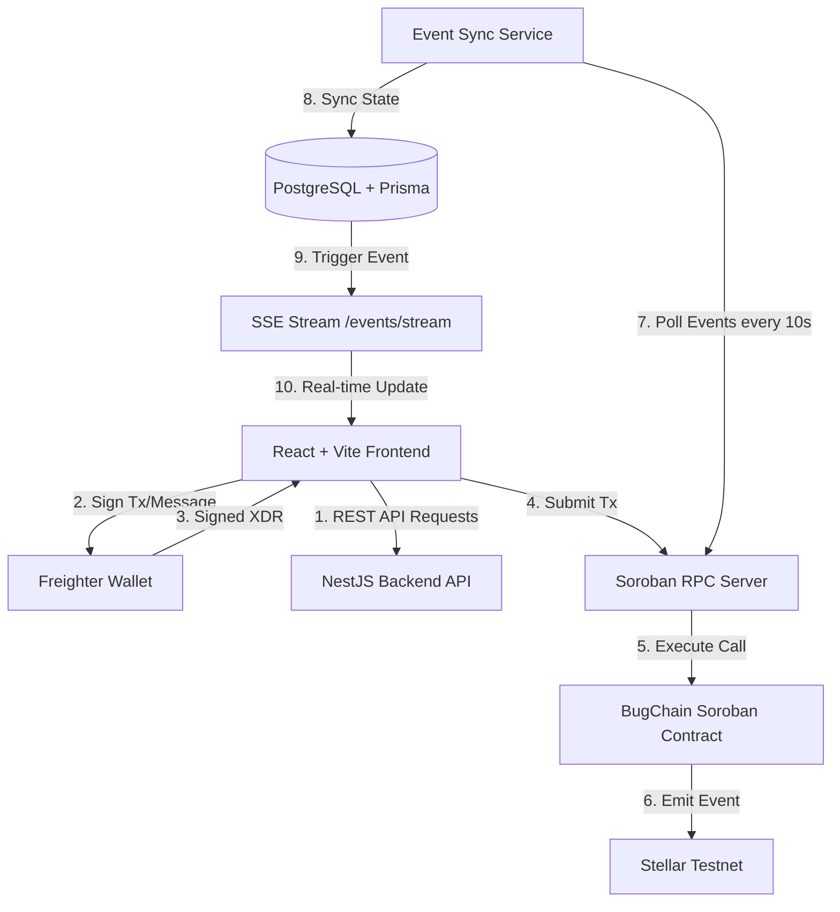

# Đánh Giá Hệ Thống & Phân Tích Kiến Trúc BugChain (Hybrid Web2/Web3)

Bản đánh giá chi tiết này được thực hiện dưới góc nhìn của một **Senior Web3, Blockchain & Fullstack Web2 Developer** nhằm phân tích toàn diện dự án **BugChain** — một nền tảng Bug Bounty lai (Hybrid) kết hợp thế mạnh của Web2 và Web3.

---

## 1. Tổng Quan Hệ Thống (System Overview)

**BugChain** giải quyết bài toán niềm tin giữa **Dự án (Bounty Owner)** và **Hacker mũ trắng (Hunter)** thông qua mô hình hybrid:
- **Web2 (NestJS, PostgreSQL, Prisma):** Đóng vai trò quản lý tài khoản người dùng, cache dữ liệu để tìm kiếm/lọc nhanh, quản lý tổ chức (Organizations/Projects), lưu vết lịch sử kiểm toán (Audit Logs), hệ thống thông báo (Notifications), danh tiếng (Reputation) và phân tích bảo mật (Security Analytics).
- **Web3 (Stellar Network, Soroban Smart Contract, Freighter Wallet):** Đảm nhận vai trò **Escrow phi tập trung** (giữ tiền thưởng), ghi nhận bằng chứng cryptographic hash của báo cáo lỗi (`report_hash`), thực hiện thanh toán tự động (trustless payouts) khi báo cáo được duyệt, và cho phép hoàn tiền (refund) tự động khi hết hạn mà không có tranh chấp.

Mô hình này giúp tối ưu hóa chi phí gas (do không cần lưu toàn bộ nội dung report cồng kềnh lên blockchain) nhưng vẫn đảm bảo tính minh bạch, không thể chối cãi (non-repudiation) của các mốc sự kiện quan trọng.

---

## 2. Phân Tích & Thiết Kế Hệ Thống (Architecture & Design)

### 2.1. Sơ đồ Kiến trúc Tổng thể (System Architecture)

Sự phối hợp giữa các thành phần trong BugChain được thiết kế chặt chẽ theo luồng dữ liệu thời gian thực:

### 2.2. Thiết Kế Cơ Sở Dữ Liệu (Database Schema)

CSDL PostgreSQL sử dụng Prisma ORM có cấu trúc phong phú và chuẩn hóa cao, hỗ trợ tốt cho việc caching các trạng thái on-chain và quản lý nghiệp vụ Web2:
- **User & Wallet:** Một user có thể liên kết nhiều ví Stellar (`Wallet`), xác thực qua cơ chế ký nonce (`nonce`, `verifiedAt`) để đảm bảo quyền sở hữu ví.
- **Bounty:** Cache thông tin của bounty on-chain (`onchainBountyId`, `rewardAmount`, `deadline`), liên kết với `Organization` và `Project`. Trạng thái gồm: `DRAFT`, `OPEN`, `UNDER_REVIEW`, `COMPLETED`, `EXPIRED`, `REFUNDED`.
- **Report:** Lưu trữ thông tin chi tiết lỗi (được mã hóa). Liên kết với `Bounty` và `Hunter`. Có lưu trữ `reportHash` tương ứng trên chain để đối chiếu. Trạng thái gồm: `DRAFT`, `PENDING`, `APPROVED`, `REJECTED`, `PAID`.
- **Transaction:** Bảng trung gian theo dõi tiến độ giao dịch (`txHash`, `type`, `status` [PENDING, SUCCESS, FAILED]) để đồng bộ trạng thái UX.
- **Reputation (ReputationProfile & ReputationBadge):** Ghi nhận thành tích của Hunter (`successRate`, `earnedXLM`, các danh hiệu như `FIRST_REPORT`, `CRITICAL_FINDER`).

### 2.3. Thiết Kế Smart Contract (Soroban Contract)

Hợp đồng thông minh viết bằng Rust (`contracts/bugchain/src/contract.rs`) hoạt động độc lập như một máy trạng thái (state machine) tài chính:
- **Bounty Storage:** Lưu trữ `Bounty` struct dưới dạng `persistent` storage, định danh bằng `u64` tự tăng.
- **Escrow Lock:** Khi `create_bounty` được gọi, contract sử dụng SDK token client chuyển số lượng `reward_amount` của `asset` (token như XLM hoặc stablecoin) từ Owner vào tài khoản của contract.
- **Cryptographic Hash Commitment:** Hunter nộp `report_hash` (SHA-256) thông qua `submit_report`, contract ghi nhận mốc thời gian và gán trạng thái `Pending`.
- **Trustless Payout (`claim_reward`):** Hunter chỉ có thể rút tiền khi report chuyển sang `Approved` bởi Owner.
- **Deadline Protection (`refund_expired_bounty`):** Bảo vệ Owner khỏi việc tiền bị kẹt vô thời hạn bằng cách cho phép rút lại quỹ nếu qua hạn deadline mà chưa có report nào được duyệt.

---

## 3. Các Điểm Đáng Chú Ý Của Dự Án (Notable Highlights)

1. **Kiến trúc Hybrid Đồng bộ Hai Chiều (Dual-Path Sync):**
   Giao dịch được phát động từ Frontend -> nộp lên ví -> submit lên Soroban RPC. Sau khi thành công, Frontend báo về Backend để cập nhật tức thời (Optimistic Update). Đồng thời, ở Backend có `EventSyncService` chạy ngầm, quét Soroban RPC mỗi 10 giây để tìm sự kiện. Nếu Frontend mất mạng hoặc tắt trình duyệt trước khi báo về backend, Worker này sẽ tự động cập nhật cơ sở dữ liệu.
2. **Cơ chế Bảo mật Session Nâng cao (Token Rotation & Reuse Detection):**
   Hệ thống xác thực JWT không chỉ có Access Token ngắn hạn mà còn tích hợp **Refresh Token Rotation**. Mỗi lần refresh sẽ sinh ra token mới. Nếu một Refresh Token cũ bị kẻ tấn công đánh cắp và cố tình tái sử dụng, hệ thống lập tức phát hiện sự trùng lặp (Reuse Detection) và hủy bỏ toàn bộ các session đang hoạt động của tài khoản đó.
3. **Mã hóa Dữ liệu Nhạy cảm ở Database (AES-256-GCM):**
   Nội dung báo cáo bảo mật (`description`, `stepsToReproduce`, `impact`, `recommendation`) được mã hóa tự động trước khi lưu xuống database thông qua `ReportEncryptionService` bằng thuật toán AES-256-GCM có kèm Initialization Vector (IV) và Authentication Tag.
4. **Hệ thống SSE (Server-Sent Events) Thời gian thực:**
   Sử dụng RxJS `Subject` tích hợp trong NestJS để phát tín hiệu cập nhật trạng thái giao dịch và thông báo mới đến Client tức thời mà không cần Client phải thực hiện polling liên tục, tiết kiệm tài nguyên mạng và tăng trải nghiệm UX.

---

## 4. Đánh Giá Mức Độ Thực Tế (Feasibility Evaluation) & Cho Điểm

Dưới đây là điểm số đánh giá cho từng khía cạnh kỹ thuật của BugChain dựa trên tiêu chuẩn sản phẩm thực tế (Production-ready):

| Yếu Tố Kỹ Thuật | Điểm số | Chi Tiết Đánh Giá |
| :--- | :---: | :--- |
| **1. Độ hoàn thiện tính năng (Completeness)** | **8.5/10** | Hệ thống có đầy đủ luồng nghiệp vụ từ Auth, Wallet Link, tạo Bounty, nộp Report, Review, Claim và Refund. Đã triển khai được các trang Analytics, Organization, User Proofs rất chi tiết. |
| **2. Kiến trúc & Thiết kế Backend (NestJS/Prisma)** | **9.0/10** | Cấu trúc module NestJS chuẩn mực, phân tách rõ ràng. CSDL Postgres được thiết kế chuẩn hóa, đánh index tốt cho các trường truy vấn thường xuyên. Code xử lý transaction bằng Prisma Client đảm bảo tính toàn vẹn dữ liệu. |
| **3. Thiết kế Smart Contract (Soroban/Rust)** | **8.0/10** | Code Rust sạch sẽ, tuân thủ tiêu chuẩn `#![no_std]`, phân chia rõ ràng giữa `contract.rs`, `storage.rs`, `types.rs`, `events.rs`. Đã viết 15 testcase unit test đạt độ tin cậy cao. |
| **4. Giao diện & Trải nghiệm (React/Vite)** | **8.5/10** | Thiết kế theo theme Dark cao cấp, hiện đại (Lavender/Violet phối màu đen sâu). Có cơ chế xử lý lỗi cục bộ (Error Boundary), hiển thị trạng thái trống (Empty State), loading skeleton và Toast notifications đầy đủ. |
| **5. Tính thực tế & Khả năng vận hành (Real-world Feasibility)** | **7.5/10** | Mô hình Hybrid rất phù hợp cho thực tế vì giảm tải phí gas lưu trữ. Tuy nhiên còn vướng một số rào cản về bảo mật mã hóa và mô hình phân phối phần thưởng cần cải tiến trước khi mainnet. |

> [!NOTE]
> **Điểm Trung Bình Cộng: 8.3 / 10** (Mức độ: **Tốt - Sẵn sàng làm bản MVP thử nghiệm thị trường**).

---

## 5. Những Điểm Chưa Ưng Ý & Giải Pháp Cải Tiến (Critiques & Recommendations)

Là một Senior Developer, tôi nhận thấy dự án có thiết kế tổng thể rất tốt nhưng vẫn tồn tại **5 vấn đề cốt lõi** cần được khắc phục để đạt chuẩn an toàn thông tin và kiến trúc Web3 thực tế:

### 5.1. Vấn đề Mã hóa Báo cáo (Report Encryption) - Chưa đạt E2EE thực sự
> [!WARNING]
> **Hiện trạng:** Nội dung báo cáo được mã hóa bằng khóa đối xứng `REPORT_ENCRYPTION_KEY` lưu tại file cấu hình `.env` của Backend.
- **Rủi ro:** Đây **không phải** là mã hóa đầu cuối (End-to-End Encryption - E2EE). Nếu máy chủ Backend bị tấn công (compromised) hoặc có lập trình viên/quản trị viên database độc hại có quyền truy cập `.env`, toàn bộ dữ liệu lỗ hổng bảo mật zero-day của các dự án lớn có thể bị giải mã và rò rỉ ra ngoài.
- **Giải pháp:** Cần chuyển đổi sang mô hình **Mã hóa bất đối xứng (Asymmetric Encryption)**. 
  1. Mỗi Dự án (Bounty Owner) khi tạo tài khoản sẽ tạo một cặp khóa (Keypair) hoặc sử dụng chính khóa công khai từ ví (Stellar Public Key).
  2. Khi Hunter nộp báo cáo, Frontend của Hunter sẽ lấy Public Key của Owner dự án đó để mã hóa nội dung report trực tiếp trên trình duyệt.
  3. Bản mã hóa (Ciphertext) được gửi lên lưu ở Backend.
  4. Chỉ có Owner dự án (sở hữu Private Key tương ứng) mới có thể giải mã và đọc nội dung report ở Frontend của họ. Backend tuyệt đối không giữ khóa giải mã.

### 5.2. Luồng Nghiệp Vụ Bounty trên Blockchain - Tranh chấp & Giới hạn Thanh toán
> [!CAUTION]
> **Hiện trạng:** Contract định nghĩa trạng thái Bounty là `Open` -> `Completed`. Một Bounty chỉ chấp nhận **duy nhất một report được duyệt** (`approved_report_id: Option<u64>`), sau đó bounty đóng lại và chuyển toàn bộ tiền cho hunter đó.
- **Hạn chế thực tế:** Đây giống như luồng giải quyết thử thách đơn lẻ (Single Task/Hackathon) hơn là một chương trình Bug Bounty liên tục. Trong thực tế, một chương trình Bug Bounty của một doanh nghiệp sẽ mở liên tục (ví dụ: Google Bug Bounty). Họ sẽ nạp một quỹ lớn (ví dụ: $100,000) và phê duyệt hàng chục báo cáo lỗi khác nhau (Low, Medium, High) với các mức trả thưởng khác nhau trích từ quỹ đó.
- **Giải pháp:** Cải tiến Smart Contract để:
  - Một Bounty hỗ trợ danh sách nhiều Approved Reports.
  - Mỗi lần phê duyệt báo cáo lỗi, contract sẽ thực hiện rút một phần tiền tương ứng với mức độ nghiêm trọng (Partial Payout) từ bể quỹ của Bounty đó thay vì chuyển toàn bộ và đóng bounty.
  - Owner có thể nạp thêm tiền (deposit) vào bể quỹ của Bounty bất kỳ lúc nào để duy trì chương trình.

### 5.3. Xác thực Giao dịch ở Backend (Transaction Trust Validation)
> [!IMPORTANT]
> **Hiện trạng:** Endpoint `updateOnChain` của backend nhận `txHash` từ frontend gửi lên và lập tức đánh dấu trạng thái giao dịch trong CSDL là `SUCCESS` (hoặc tạo giao dịch thành công).
- **Rủi ro:** Kẻ tấn công có thể giả mạo request API bằng cách gửi một `txHash` hợp lệ của một giao dịch bất kỳ khác trên Stellar (ví dụ: một giao dịch gửi tiền thông thường giữa 2 ví cá nhân của hắn) để lừa backend cập nhật trạng thái Bounty là `OPEN` hoặc duyệt khống Report mà thực tế không tốn tiền escrow vào contract.
- **Giải pháp:** Tại API xử lý ở Backend, trước khi cập nhật database, cần gọi sang Soroban RPC để **verify giao dịch** một cách đồng bộ:
  1. Kiểm tra xem `txHash` đó có tồn tại trên blockchain không.
  2. Kiểm tra xem giao dịch đó có gọi đến đúng Contract ID của BugChain không.
  3. Kiểm tra xem phương thức được gọi (`method`) có khớp với hành động không (ví dụ: `create_bounty` đối với luồng tạo bounty).
  4. Kiểm tra xem số tiền, người gửi, người nhận trong giao dịch thực tế trên chain có khớp với dữ liệu gửi lên API không.

### 5.4. Lỗ Hổng Mất Sự Kiện khi Offline của Event Sync Service
> [!WARNING]
> **Hiện trạng:** Trong `EventSyncService.ts`, khi khởi tạo, service lấy ledger sequence mới nhất và trừ đi 200 làm điểm bắt đầu (`this.lastLedger = sequence - 200`).
- **Rủi ro:** 200 ledgers trên mạng Stellar tương đương khoảng 15-20 phút. Nếu backend bị sập hoặc bảo trì trong thời gian dài hơn (ví dụ: sập nguồn 2 tiếng), khi khởi động lại, service sẽ bỏ qua toàn bộ các ledgers trung gian và chỉ quét ngược lại 200 ledgers gần nhất. Kết quả là toàn bộ các giao dịch/sự kiện on-chain diễn ra trong khoảng thời gian sập nguồn sẽ **bị mất vĩnh viễn** khỏi hệ thống cache của backend.
- **Giải pháp:** Lưu trữ giá trị `lastProcessedLedger` vào một bảng cấu hình hệ thống trong Database. Mỗi khi quét xong một ledger thành công, cập nhật số ledger đó vào DB. Khi service khởi động lại, đọc số ledger này lên và tiếp tục quét từ đó trở đi (Durable Event Indexing).

### 5.5. Thiếu Cơ Chế Trọng Tài / Giải Quyết Tranh Chấp (Dispute Resolution)
- **Hiện trạng:** Hiện tại, quyền phê duyệt hoặc bác bỏ report nằm hoàn toàn trong tay Bounty Owner.
- **Rủi ro:** Nếu Bounty Owner là một dự án không uy tín, họ có thể nhận báo cáo lỗi của Hunter, âm thầm sửa lỗi đó trên source code của họ, sau đó bấm **Reject** báo cáo trên BugChain để không phải trả tiền thưởng. Hunter mất trắng công sức mà không thể làm gì được vì contract chỉ cho phép Owner gọi hàm `approve_report` hoặc `reject_report`.
- **Giải pháp:** Tích hợp cơ chế **Trọng tài phi tập trung (Arbitration)** hoặc **Multisig Reviewer**. Dự án nên có một bên thứ ba độc lập (Triage Team / Kleros-like Judge Pool) làm trọng tài. Khi có tranh chấp (Dispute), Hunter có thể gửi yêu cầu trọng tài lên contract. Một hội đồng gồm các Reviewer uy tín sẽ bỏ phiếu biểu quyết để quyết định tiền thưởng sẽ thuộc về ai trên chuỗi.

---

## 6. Kết Luận

**BugChain** là một dự án xuất sắc, kết hợp nhuần nhuyễn tư duy thiết kế hệ thống hiện đại của Web2 và tính năng giao dịch phi tập trung an toàn của Web3. Chất lượng mã nguồn của cả NestJS backend, React frontend và Soroban contract đều ở mức cao, có tổ chức và tuân thủ các quy tắc lập trình tốt.

Nếu dự án được cải tiến về cơ chế **Mã hóa E2EE thực sự**, **Xác thực txHash đồng bộ** và **Tối ưu hóa Event Sync lưu ledger**, BugChain hoàn toàn có thể trở thành một sản phẩm thương mại cạnh tranh trực tiếp với các nền tảng Bug Bounty truyền thống nhờ lợi thế chi phí thấp và tính minh bạch tuyệt đối của công nghệ Blockchain.
